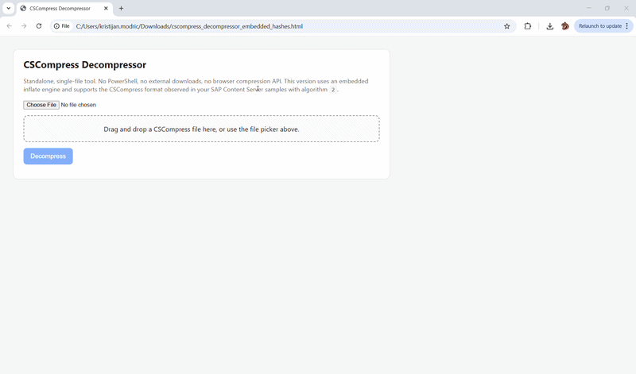

# CSCompress_Decompressor

CSCompress_Decompressor is a standalone toolset for decompressing SAP Content Server files stored in the **CSCompress** format.

The project was created to analyze and recover original files, especially PDF documents, outside the SAP system. It parses the CSCompress header, decompresses the payload, and restores the original file content in a standalone way.

## Demo

  

## Overview

This repository contains multiple standalone implementations of the same idea, created for different usage scenarios:

- **HTML version** – a browser-based standalone utility with a simple user interface
- **Python version** – useful for technical analysis, scripting, and validation
- **PHP version** – suitable for lightweight upload-and-decompress web scenarios

All versions were created to help analyze and recover SAP Content Server files compressed with CSCompress, without requiring direct SAP system access.

## Important Note

This project is currently **tested and validated using PDF files** compressed in SAP Content Server.

The decompression logic itself is based on the **CSCompress format**, not on PDF syntax only. This means that other file types may also work if they use the same CSCompress variant. However, the current implementation and the included validation examples are focused on **PDF-based test cases**.

## Features

- Decompresses SAP Content Server files stored in CSCompress format
- Supports recovery of original PDF files
- Parses CSCompress header information
- Calculates file hashes for validation
- Provides multiple standalone implementations for different environments

## Use Cases

This project can be useful for:

- technical analysis of compressed SAP Content Server files
- standalone recovery of original PDF documents
- troubleshooting ArchiveLink or Content Server scenarios
- file integrity validation using hashes
- reverse-engineering and format analysis of CSCompress data

## Included Versions

- `cscompress_decompressor_embedded_hashes.html` – standalone browser-based version
- `cscompress_decompressor.py` – Python standalone version
- `cscompress_decompressor.php` – PHP standalone version

## Examples

The repository also includes **five real validation pairs** used during development and testing.

Each pair contains:
- the **original PDF file**
- the corresponding **CSCompress-compressed output** retrieved after storage in SAP Content Server

These examples are provided to make the format analysis reproducible and to demonstrate that the decompression result matches the original file content.

## Repository Structure

- `cscompress_decompressor_embedded_hashes.html` – HTML/JavaScript standalone decompressor
- `cscompress_decompressor.py` – Python implementation
- `cscompress_decompressor.php` – PHP implementation
- `images/CSCompressDecompressor.gif` – demo animation
- `examples/` – original PDF files and matching CSCompress-compressed file pairs
- `README.md` – project overview and documentation

## Notes

The decompression logic in this repository was validated against real pairs of original and CSCompress-compressed files. It is intended as a practical standalone solution for analyzing and restoring files outside SAP.

Depending on the SAP Content Server setup and the specific CSCompress variant in use, additional validation may still be useful.

## Future Improvements

Possible future enhancements include:

- support for additional CSCompress variants
- batch processing of multiple files
- richer metadata parsing
- drag-and-drop support in all standalone versions

## Feedback

If you have worked with SAP Content Server internals, CSCompress files, or similar recovery scenarios, feel free to open an issue or share your thoughts. Feedback and alternative implementations are very welcome.
